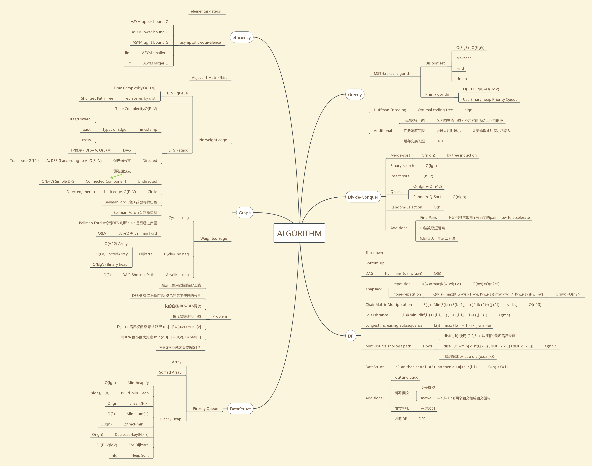

# Intro-Algorithm
Introduction to Algorithm
## Complexity
1. Begin with elementary steps
2. Time/Space complexity  
   - Asymptotic bound: `O` `θ` `Ω`  
   - Asymptotic comparison: `o` `ω`
## Graph
- Unweighed edge
  - BFS - Queue
    - shortest path tree
  - DFS - Stack
    - edge type: foward/tree, back, cross
    - DAG: topo-sort
    - strong connected component: topo+dfs
    - weak connected component: simple dps
- Weighted edge: single source shortest path
  - Acyclic
    - topo-sort
  - Cyclic+non-neg
    - Dijkstra
  - Cyclic+neg
    - Bellman-ford
## Data structure
- Priority queue
  - list
  - binary heap
- Disjoint set
## Greedy
- MST
  - Krusal algorithm
  - Prim algorithm
- Huffman Encoding
  - optimal coding tree
- Optimized subproblem
## Divide and conquer
- Master Theorem
- Merge sort
- Binary search
- Insert sort
- Q-sort
  - Random Q-sort
- Random selection
  - derandomization
## Dynamic programming
- Top down vs. Bottom up
- DAG
- Knapsack
  - repetition
  - non-repetition
- ChainMatrix Multiplication
- Edit Distance
- Longest Increasing Subsequence
- LCS
- Floyd-Warshall
  - multi-source shortest path
## Knowledge Map
